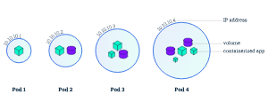

# Introdução ao Kubernetes - Requisitos para o Laboratório

Bem-vindo ao webinar de Introdução ao Kubernetes na prática! Este repositório contém os arquivos e instruções necessários para você acompanhar o laboratório prático. Antes de começar, é importante garantir que você atenda aos requisitos mínimos abaixo.

## Requisitos do Ambiente

* Instância ou VM Linux
* Recursos mínimos: Pelo menos 2 CPUs, 2 GB de RAM e 20 GB de espaço em disco.
* Sistema Operacional: **Ubuntu 20.04 LTS** ou uma versão mais recente.
* Permissões administrativas são necessárias para instalar software e configurar o ambiente.

### 3. K3s
K3s é uma distribuição leve do Kubernetes que é fácil de instalar e gerenciar. Para instalar e configurar um cluster K3s, siga estas etapas:

- Execute o comando para instalar o K3s:
  ```bash
  sudo apt update
  curl -sfL https://get.k3s.io | sh -
  sudo k3s kubectl get nodes

- Instalar auto complete e permitir rodar o kubectl sem sudo
  ```bash
  sudo kubectl completion bash | sudo tee /etc/bash_completion.d/kubectl > /dev/null
  sudo chmod a+r /etc/bash_completion.d/kubectl
  sudo chown -R $USER /etc/rancher/k3s/k3s.yaml

## Opções Alternativas

Caso prefira ou não tenha os recursos mencionados acima, existem duas opções alternativas para criar seu ambiente Kubernetes:

### 1. Minikube
Minikube permite executar um cluster Kubernetes local em uma máquina. É uma boa opção para testes e desenvolvimento.

- Instale o Minikube seguindo a [documentação oficial](https://minikube.sigs.k8s.io/docs/start/).

### 2. Kind (Kubernetes IN Docker)
Kind é uma ferramenta para rodar Kubernetes em contêineres Docker. É ideal para ambientes de desenvolvimento locais.

- Instale o Kind seguindo as instruções disponíveis na [documentação oficial](https://kind.sigs.k8s.io/docs/user/quick-start/).


## Resumo do Treinamento

Neste treinamento de Introdução ao Kubernetes, com duração de uma hora e meia, abordaremos os seguintes tópicos:

1. **Conceitos Básicos do Kubernetes**:
   - Introdução ao Kubernetes e seus principais componentes.
   - Visão geral da arquitetura do Kubernetes.
   - Funções dos principais objetos do Kubernetes, como Pods, Services, e Deployments.

2. **Instalação e Configuração**:
   - Configuração rápida de um cluster Kubernetes utilizando K3s.
   - Alternativas para ambientes locais com Minikube e Kind.

3. **Trabalhando com Kubernetes**:
   - Criação e gerenciamento de Pods.
   - Configuração básica de Services para expor aplicações.
   - Uso de Deployments para gerenciar a disponibilidade de aplicações.

### Arquivos YAML

Os arquivos YAML que utilizaremos durante o treinamento estarão disponíveis no diretório `yaml-files` deste repositório. Esses arquivos serão essenciais para criar e configurar os recursos no seu cluster Kubernetes durante as atividades práticas.

Para aplicar qualquer um desses arquivos YAML, você pode utilizar o comando:

```bash 
   kubectl apply -f caminho-do-arquivo.yaml
```


## Tópicos Abordados no Kubernetes

Nesta seção, você encontrará uma introdução e links úteis para a documentação oficial dos principais componentes que iremos utilizar ao longo do webinar. Cada conceito abaixo é fundamental para a administração e orquestração de containers no Kubernetes.

### 1. **Pod**

O Pod é a menor unidade do Kubernetes, representando um ou mais containers que compartilham a mesma rede e o mesmo armazenamento. Ele é essencialmente a camada de abstração que gerencia os containers, garantindo que eles sejam executados corretamente.



- [Documentação oficial do Pod](https://kubernetes.io/docs/concepts/workloads/pods/)

### 2. **Deployment**

O Deployment é utilizado para gerenciar a criação e a escalabilidade dos Pods. Ele garante que o número correto de réplicas esteja sempre rodando no cluster e permite fazer atualizações contínuas dos containers sem downtime.

- [Documentação oficial do Deployment](https://kubernetes.io/docs/concepts/workloads/controllers/deployment/)

### 3. **Services**

Os Services no Kubernetes são responsáveis por expor aplicações rodando nos Pods, permitindo que essas aplicações se comuniquem entre si e com o mundo exterior. Existem diferentes tipos de Service, como **ClusterIP**, **NodePort**, e **LoadBalancer**, cada um com diferentes casos de uso.

- [Documentação oficial dos Services](https://kubernetes.io/docs/concepts/services-networking/service/)

### 4. **Namespace**

Namespaces são uma maneira de dividir logicamente o cluster, permitindo que você segmente recursos e políticas. Eles são úteis para organizar projetos, equipes ou ambientes (desenvolvimento, teste, produção) dentro de um mesmo cluster Kubernetes.

- [Documentação oficial dos Namespaces](https://kubernetes.io/docs/concepts/overview/working-with-objects/namespaces/)

### 5. **ConfigMap**

ConfigMaps são usados para armazenar pares de chave-valor que podem ser acessados pelos Pods. Eles ajudam a separar a configuração da lógica da aplicação, permitindo que você altere configurações sem precisar reconstruir a imagem do container.

- [Documentação oficial do ConfigMap](https://kubernetes.io/docs/concepts/configuration/configmap/)

### 6. **Secrets**

Secrets são usados para armazenar informações confidenciais, como senhas, tokens ou chaves de API, de maneira segura. Assim como o ConfigMap, eles podem ser referenciados pelos Pods sem incluir essas informações diretamente nas imagens dos containers.

- [Documentação oficial dos Secrets](https://kubernetes.io/docs/concepts/configuration/secret/)

---

